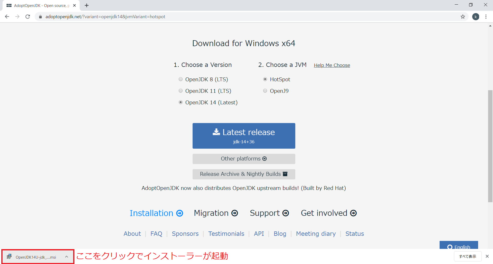

# jdkインストールマニュアル

ここでは、windows向けのjdkのインストール手順を紹介します。

## 手順1 : インストーラーをダウンロード

※このマニュアルではダウンロードを `Chrome` から行っています。

下記URLにアクセスして以下のページを開きます。

https://adoptopenjdk.net/

`Choose a Version` は最新のものを選択します。(画像では14になっています。)

青い `Latest release` ボタンを押下するとダウンロードが始まります。

## 手順2 : インストーラを起動

ダウンロードが完了したらインストーラーを起動します。`Chrome` でダウンロードした場合、画面左下にダウンロードのログが残るので、そこをクリックするとインストーラーが起動します。

画面にダウンロードのログが残っていない場合は、自身のパソコンのダウンロードファイル内からインストーラーを起動します。

インストーラを開くと以下のような画面が立ち上がります。

## 手順3 : インストールの設定

インストーラーの画面が立ち上がったら次へを押下します。

そうすると、以下のような画面が立ち上がります。

よく読んで使用許諾契約書の同意欄にチェックを入れ次へボタンを押下します。

以下のような画面が立ち上がったら `Set JAVA_HOME variable` のドロップダウンを開き `ローカルハードドライブにインストール` を選択します。

選択が完了したら次へを押下します。

以下のような画面が立ち上がったらインストールの準備は完了です。

`インストール` ボタンを押下してインストールを開始します。

## 手順4 : 確認

インストールの終了後、jdkが正常にインストールされているか確認します。

以下の手順で確認してください。

1. コマンドプロンプトを開く

デスクトップ画面で `Windows キー` を押下しながら `R` キーを押下します。

以下の画面が立ち上がったら、`cmd` と入力し `OK` ボタンを押下します。

2. コマンドを入力

コマンドプロンプトが立ち上がったら、`java -version`と入力し、Enterを押下します。

3. Javaのバージョンを確認

3の手順で自身でインストールしたjdkと同じバージョンが表示されていれば完了です。
